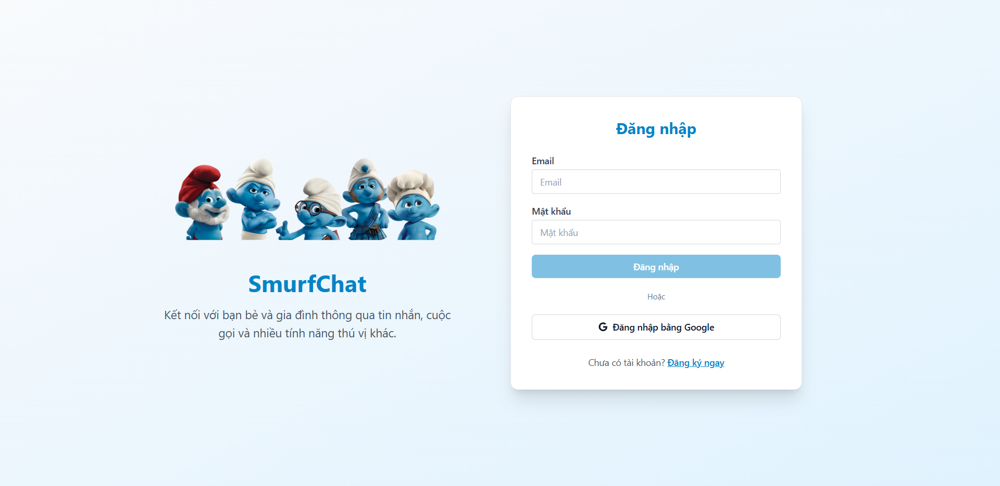

# 🚀 SmurfChat - Ứng dụng Chat Thời Gian Thực

<div align="center">
  
  
  *Giao diện chính của ứng dụng SmurfChat*
</div>

## 👥 Nhóm Thực Hiện

**Trường:** Đại học Công Thương TP.HCM  
**Khoa:** Công Nghệ Thông Tin  
**Thành viên:**

- **Trần Công Minh**
- **Lê Đức Trung**
- **Nguyễn Chí Tài**
- **Tạ Nguyên Vũ**

---

## 📋 Giới Thiệu Dự Án

SmurfChat là một ứng dụng chat thời gian thực hiện đại được xây dựng với React và Firebase. Ứng dụng cung cấp trải nghiệm chat mượt mà với nhiều tính năng thông minh như quản lý phòng chat, tin nhắn trực tiếp, chia sẻ file, ghi âm giọng nói và hệ thống kết bạn.

## ✨ Tính Năng Chính

### 🔐 Xác Thực & Bảo Mật

- Đăng ký/Đăng nhập bằng Email và Password
- Xác thực người dùng với Firebase Authentication
- Bảo mật dữ liệu với Firestore Security Rules

### 💬 Chat & Nhắn Tin

- **Chat thời gian thực** với WebSocket
- **Tin nhắn nhóm** trong phòng chat
- **Tin nhắn trực tiếp** (Direct Messages) 1-1
- **Thu hồi tin nhắn** trong vòng 10 phút
- **Đánh dấu đã đọc** và trạng thái online
- **Emoji picker** với hỗ trợ Unicode đầy đủ
- **Quick reactions** cho tin nhắn

### 🏠 Quản Lý Phòng Chat

- Tạo và quản lý phòng chat
- Mời thành viên vào phòng
- Phân quyền admin và thành viên
- **Chuyển quyền admin** cho thành viên khác
- **Rời khỏi phòng** hoặc **giải tán phòng**
- **Upload avatar nhóm**
- **Ghim cuộc trò chuyện** quan trọng

### � Hệ Thống Kết Bạn

- Gửi lời mời kết bạn
- Chấp nhận/Từ chối lời mời
- Quản lý danh sách bạn bè
- Tìm kiếm người dùng theo tên

### 📎 Chia Sẻ File & Media

- **Upload file** với Supabase Storage
- **Chia sẻ hình ảnh** với preview
- **Ghi âm và gửi tin nhắn thoại**
- **Chia sẻ vị trí** với Google Maps
- **Chụp ảnh trực tiếp** từ camera

### 🎨 Giao Diện & Trải Nghiệm

- **Dark/Light Mode** với theme switcher
- **Responsive design** cho mọi thiết bị
- **Real-time typing indicators**
- **Push notifications** cho tin nhắn mới
- **Infinite scroll** cho lịch sử chat

## 🛠️ Công Nghệ Sử Dụng

### Frontend

- **React 17** - UI Framework
- **React Router DOM** - Client-side routing
- **React Icons** - Icon library
- **Tailwind CSS** - Utility-first CSS framework
- **date-fns** - Date manipulation library
- **emoji-picker-react** - Emoji selection component
- **Lodash** - JavaScript utility library

### Backend & Database

- **Firebase 9**
  - Firestore Database (NoSQL)
  - Firebase Authentication
  - Real-time listeners
- **Supabase Storage** - File storage solution

### Build Tools & Development

- **Create React App 5** - Development environment
- **PostCSS & Autoprefixer** - CSS processing
- **React Scripts** - Build and development scripts

## 🚀 Hướng Dẫn Cài Đặt

### Yêu Cầu Hệ Thống

- **Node.js** 14.0 trở lên
- **npm** hoặc **yarn** package manager
- **Git** để clone repository

### Bước 1: Clone Dự Án

```bash
git clone https://github.com/dexter826/SmurfChat.git
cd SmurfChat
```

### Bước 2: Cài Đặt Dependencies

```bash
npm install
# hoặc
yarn install
```

### Bước 3: Cấu Hình Environment Variables

Tạo file `.env` trong thư mục root với nội dung:

```env
# Firebase Configuration
REACT_APP_FIREBASE_API_KEY=your_firebase_api_key
REACT_APP_FIREBASE_AUTH_DOMAIN=your_project.firebaseapp.com
REACT_APP_FIREBASE_PROJECT_ID=your_project_id
REACT_APP_FIREBASE_STORAGE_BUCKET=your_project.appspot.com
REACT_APP_FIREBASE_MESSAGING_SENDER_ID=your_sender_id
REACT_APP_FIREBASE_APP_ID=your_app_id
REACT_APP_FIREBASE_MEASUREMENT_ID=your_measurement_id

# Supabase Configuration (for file storage)
REACT_APP_SUPABASE_URL=your_supabase_url
REACT_APP_SUPABASE_ANON_KEY=your_supabase_anon_key
```

### Bước 4: Thiết Lập Firebase

1. **Tạo Firebase Project:**

   - Truy cập [Firebase Console](https://console.firebase.google.com/)
   - Tạo project mới
   - Thêm web app vào project

2. **Cấu hình Authentication:**

   - Bật **Email/Password** authentication
   - Thiết lập authorized domains nếu cần

3. **Thiết lập Firestore Database:**
   - Tạo Firestore database ở chế độ production
   - Cấu hình Security Rules:

```javascript
rules_version = '2';
service cloud.firestore {
  match /databases/{database}/documents {
    // Users can read/write their own data
    match /users/{userId} {
      allow read, write: if request.auth != null && request.auth.uid == userId;
      allow read: if request.auth != null; // Allow reading other users for search
    }

    // Room members can read/write messages
    match /messages/{messageId} {
      allow read, write: if request.auth != null &&
        request.auth.uid in resource.data.roomMembers;
    }

    // Room management
    match /rooms/{roomId} {
      allow read, write: if request.auth != null &&
        request.auth.uid in resource.data.members;
    }

    // Direct messages
    match /directMessages/{messageId} {
      allow read, write: if request.auth != null;
    }

    // Conversations
    match /conversations/{conversationId} {
      allow read, write: if request.auth != null &&
        request.auth.uid in resource.data.participants;
    }

    // Friend system
    match /friends/{friendId} {
      allow read, write: if request.auth != null;
    }

    match /friend_requests/{requestId} {
      allow read, write: if request.auth != null;
    }


    match /votes/{voteId} {
      allow read, write: if request.auth != null;
    }
  }
}
```

### Bước 5: Thiết Lập Supabase Storage

1. **Tạo Supabase Project:**

   - Truy cập [Supabase](https://supabase.com/)
   - Tạo project mới

2. **Cấu hình Storage:**
   - Tạo bucket có tên `chat-files`
   - Thiết lập public access policies

### Bước 6: Chạy Ứng Dụng

```bash
npm start
# hoặc
yarn start
```

Ứng dụng sẽ chạy tại `http://localhost:3000`

### Bước 7: Build cho Production

```bash
npm run build
# hoặc
yarn build
```

## 📁 Cấu Trúc Dự Án

```
SmurfChat/
├── public/                     # Static files
│   ├── index.html             # HTML template
│   ├── manifest.json          # PWA manifest
│   ├── gui.png               # Demo screenshot
│   └── sounds/               # Audio files
│
├── src/
│   ├── components/           # React components
│   │   ├── ChatRoom/        # Chat related components
│   │   │   ├── ChatWindow.jsx      # Main chat interface
│   │   │   ├── ConversationWindow.jsx  # Direct message interface
│   │   │   ├── Message.jsx         # Message component
│   │   │   ├── RoomList.jsx        # Room list sidebar
│   │   │   ├── UnifiedChatList.jsx # Unified chat list
│   │   │   ├── UserInfo.jsx        # User profile info
│   │   │   ├── EmojiPicker.jsx     # Emoji selection
│   │   │   └── VoteMessage.jsx     # Vote/Poll messages
│   │   │
│   │   ├── Login/           # Authentication
│   │   │   ├── index.jsx           # Login form
│   │   │   └── Register.jsx        # Registration form
│   │   │
│   │   ├── Modals/          # Modal dialogs
│   │   │   ├── AddRoomModal.jsx    # Create room modal
│   │   │   ├── InviteMemberModal.jsx # Invite users modal
│   │   │   ├── AddFriendModal.jsx  # Add friend modal
│   │   │   ├── CalendarModal.jsx   # Calendar view modal
│   │   │   ├── VoteModal.jsx       # Vote creation modal
│   │   │   └── NewMessageModal.jsx # New message modal
│   │   │
│   │   ├── FileUpload/      # File handling
│   │   │   ├── FileUpload.jsx      # File upload component
│   │   │   ├── FilePreview.jsx     # File preview
│   │   │   ├── VoiceRecording.jsx  # Voice message recording
│   │   │   └── LocationPreview.jsx # Location sharing
│   │   │
│   │   ├── Common/          # Shared components
│   │   │   └── AlertModal.jsx      # Alert notifications
│   │   │
│   │   └── Notifications/   # Notification system
│   │
│   ├── Context/             # React Context providers
│   │   ├── AppProvider.jsx         # App state management
│   │   ├── AuthProvider.jsx        # Authentication state
│   │   ├── ThemeProvider.jsx       # Theme management
│   │   └── AlertProvider.jsx       # Alert system
│   │
│   ├── firebase/            # Firebase configuration
│   │   ├── config.js              # Firebase setup
│   │   └── services.js            # Firebase services
│   │
│   ├── supabase/           # Supabase configuration
│   │   ├── config.js             # Supabase setup
│   │   └── storage.js            # File storage services
│   │
│   ├── hooks/              # Custom React hooks
│   │   ├── useFirestore.js       # Firestore data hooks
│   │   ├── useEmoji.js           # Emoji utilities
│   │   └── useOnlineStatus.js    # Online status tracking
│   │
│   ├── App.jsx             # Main App component
│   ├── App.css             # Global styles
│   ├── index.js            # App entry point
│   └── index.css           # Base styles
│
├── build/                  # Production build output
├── package.json           # Dependencies và scripts
├── tailwind.config.js     # Tailwind CSS configuration
├── postcss.config.js      # PostCSS configuration
└── firebase.json          # Firebase hosting config
```

## 🔧 Scripts Có Sẵn

Trong thư mục dự án, bạn có thể chạy các lệnh sau:

### `npm start`

Chạy ứng dụng ở chế độ development.  
Mở [http://localhost:3000](http://localhost:3000) để xem trong browser.

### `npm run build`

Build ứng dụng cho production vào thư mục `build/`.  
Tối ưu hóa build để có hiệu suất tốt nhất.

### `npm run eject`

**Lưu ý: Đây là thao tác một chiều. Một khi đã `eject`, không thể quay lại!**

## 🌟 Tính Năng Nổi Bật

### 🔄 Real-time Synchronization

- **WebSocket connections** cho cập nhật tức thì
- **Optimistic updates** cho UX mượt mà
- **Offline support** với local caching
- **Auto-reconnection** khi mất kết nối

### 🎯 Smart Features

- **Smart search** với fuzzy matching
- **Typing indicators** hiển thị ai đang gõ
- **Message status** (sent, delivered, read)
- **Auto-scroll** đến tin nhắn mới

### 📱 Mobile-First Design

- **Progressive Web App** (PWA) support
- **Touch-friendly** interface
- **Responsive layouts** cho mọi màn hình
- **Native app-like** experience

## 📊 Database Schema

### Collections trong Firestore:

#### `users`

```javascript
{
  uid: string,
  displayName: string,
  email: string,
  photoURL: string,
  searchVisibility: 'public' | 'friends' | 'private',
  keywords: string[],
  createdAt: timestamp,
  lastSeen: timestamp
}
```

#### `rooms`

```javascript
{
  id: string,
  name: string,
  description: string,
  admin: string, // user uid
  members: string[], // array of user uids
  avatar: string,
  lastMessage: string,
  lastMessageAt: timestamp,
  dissolved: boolean,
  pinned: boolean,
  mutedBy: object // { userId: boolean }
}
```

#### `messages`

```javascript
{
  id: string,
  text: string,
  uid: string,
  displayName: string,
  photoURL: string,
  roomId: string,
  messageType: 'text' | 'file' | 'voice' | 'location',
  fileData: object,
  recalled: boolean,
  readBy: string[],
  createdAt: timestamp
}
```

#### `conversations`

```javascript
{
  id: string,
  participants: string[], // [uid1, uid2]
  lastMessage: string,
  lastMessageAt: timestamp,
  createdAt: timestamp
}
```

#### `friends`

```javascript
{
  id: string,
  participants: string[], // [uid1, uid2] sorted
  createdAt: timestamp
}
```

## 📄 License

Dự án này được phân phối dưới **MIT License**. Xem file `LICENSE` để biết thêm chi tiết.

---

<div align="center">
  <strong>🎓 Đồ án môn học NoSQL - Trường Đại học Công Thương TP.HCM</strong><br>
  <em>Khoa Công Nghệ Thông Tin</em>
</div>
